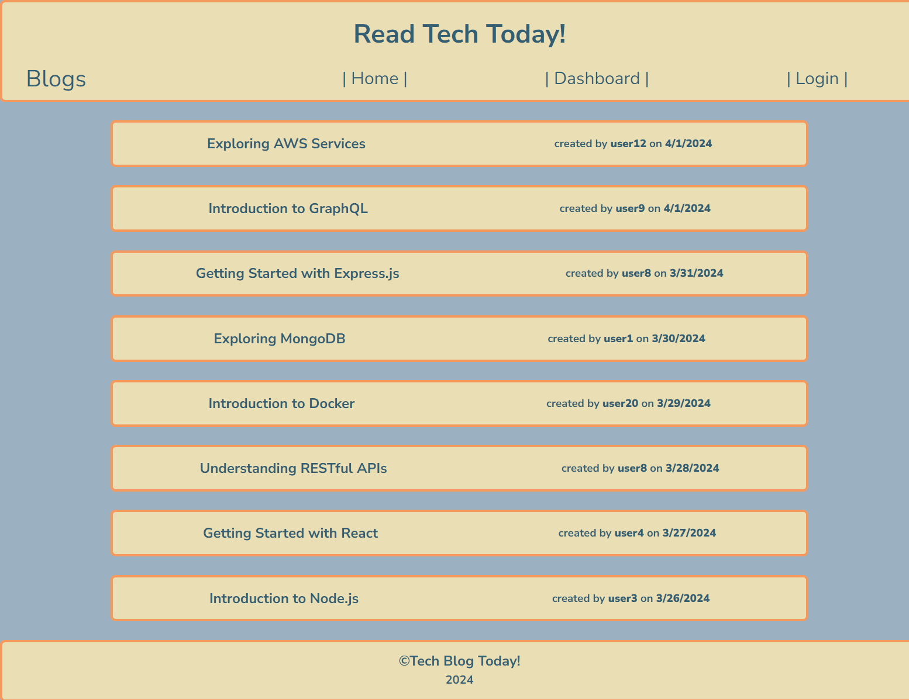

# Read Tech Today!
GitHub Repo: https://github.com/jheersink8/tech-blog

Deployed Site: https://read-tech-today.onrender.com/ 

## Installation 
This appication is fully deployed to the Render and does not require installation. 

## Description
This website acts as a simple blog site where users can add content, edit it, and delete it. This website works in a full stack environment on the MVC paradigm and has a fully functional API. This website demonstrates a working knowledge of the following: 

- Node.js
- Handlebars
- Sequelize
- Express.js
- Express npm packages
- Authentication configuration
- The MVC paradigm 
- PostgreSQL
- Creating a using APIs
- CRUD (create, read, update, and delete) 
- Insomnia
- pgAdmin4

## Usage
Once at the website, the user can perform the following actions: 
  

**Authentication Actions**
- Create an account (password must have at least 8 characters)
- Log in with existing account
- Log out of account

**All Blog Actions**
- View all user’s blogs 
- Add comments to user’s blogs

**User Blog Actions**
- View a list of all personally created blogs
- Add new blogs
- Update existing blogs
- Delete blogs 

  

## Credits
- Scenario presented by Denver University in the Bootcamp course ID DU-VIRT-FSF-PT-12-2023-U-LOLC-MWTH under Module 14 Challenge. All code written and submitted by Jordan R. Heersink. Seed data created by ChatGPT. 
- This tool uses Node.js, Express.js, PostgreSQL, Sequelize, and Express-Handlebars

## License
https://opensource.org/licenses/MIT 

  Copyright (c) {{ 2024 }} {{ Jordan Heersink }}
    Permission is hereby granted, free of charge, to any person obtaining a copy
    of this software and associated documentation files (the "Software"), to deal
    in the Software without restriction, including without limitation the rights
    to use, copy, modify, merge, publish, distribute, sublicense, and/or sell
    copies of the Software, and to permit persons to whom the Software is
    furnished to do so, subject to the following conditions:
    
    The above copyright notice and this permission notice shall be included in all
    copies or substantial portions of the Software.
    
    THE SOFTWARE IS PROVIDED "AS IS", WITHOUT WARRANTY OF ANY KIND,
    EXPRESS OR IMPLIED, INCLUDING BUT NOT LIMITED TO THE WARRANTIES OF
    MERCHANTABILITY, FITNESS FOR A PARTICULAR PURPOSE AND NONINFRINGEMENT.
    IN NO EVENT SHALL THE AUTHORS OR COPYRIGHT HOLDERS BE LIABLE FOR ANY CLAIM,
    DAMAGES OR OTHER LIABILITY, WHETHER IN AN ACTION OF CONTRACT, TORT OR
    OTHERWISE, ARISING FROM, OUT OF OR IN CONNECTION WITH THE SOFTWARE OR THE USE
    OR OTHER DEALINGS IN THE SOFTWARE.